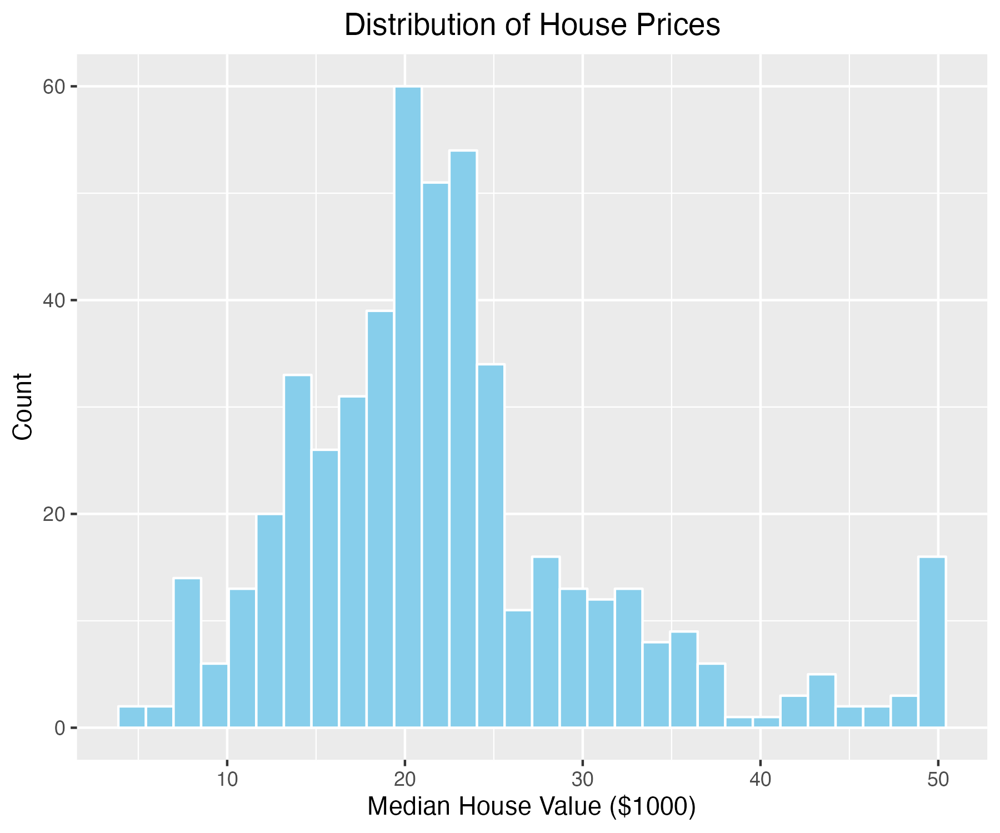
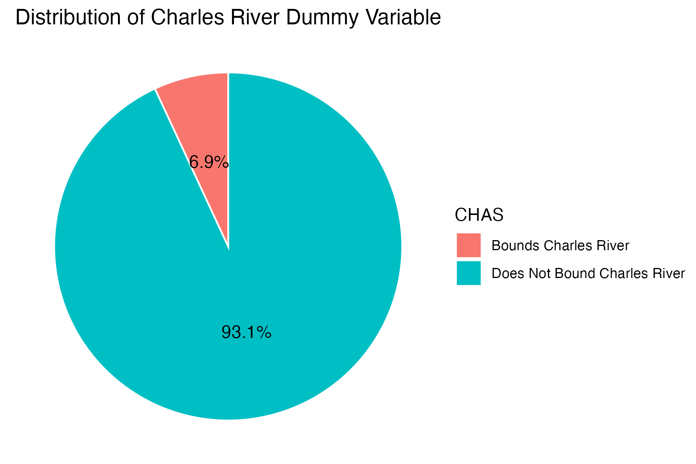
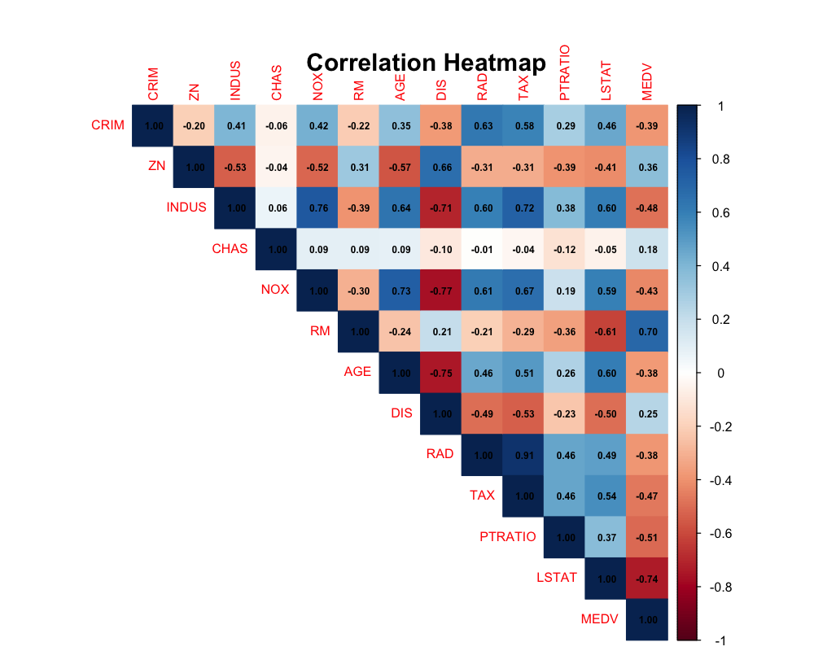
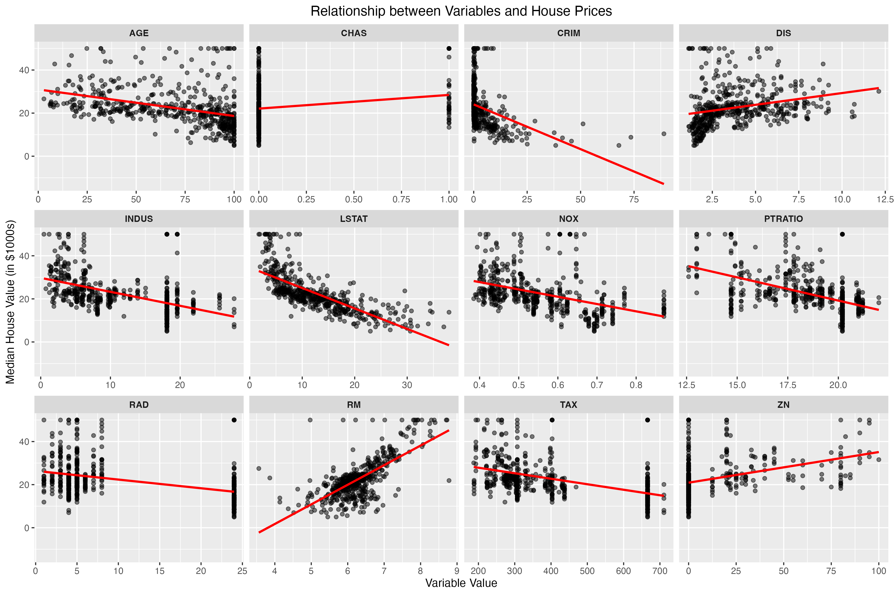
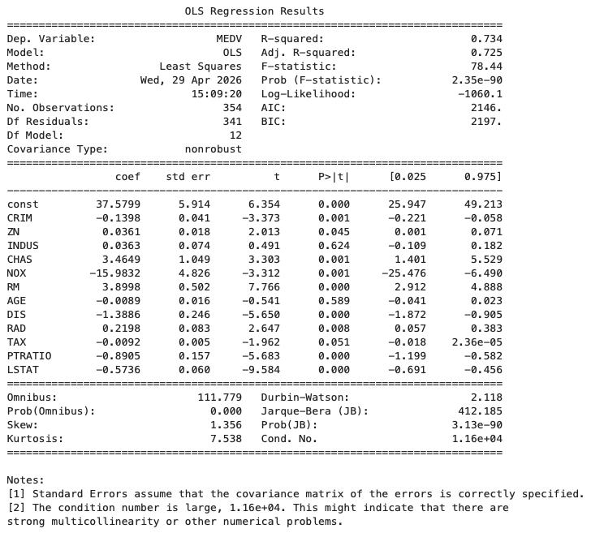
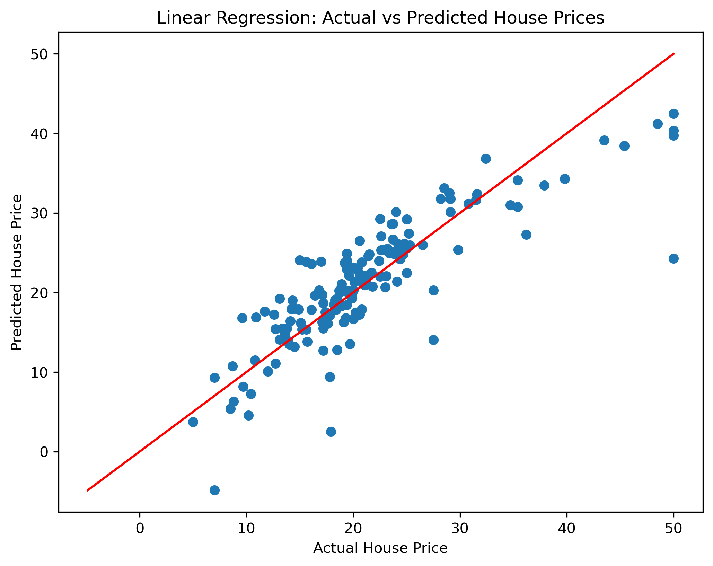
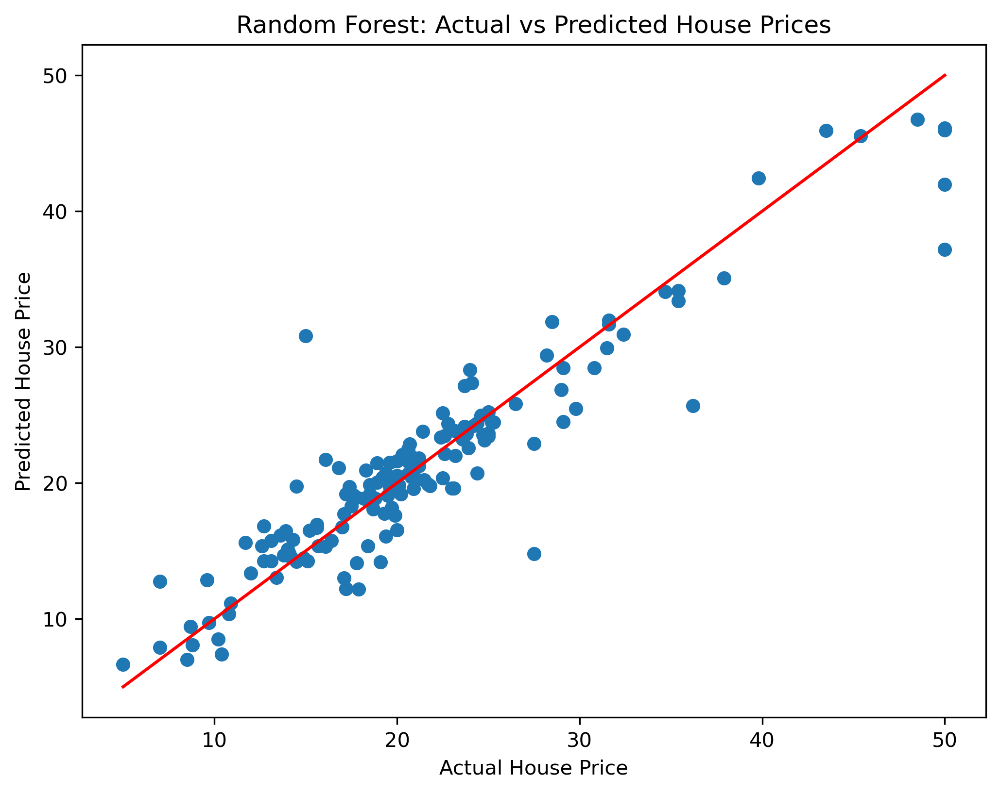
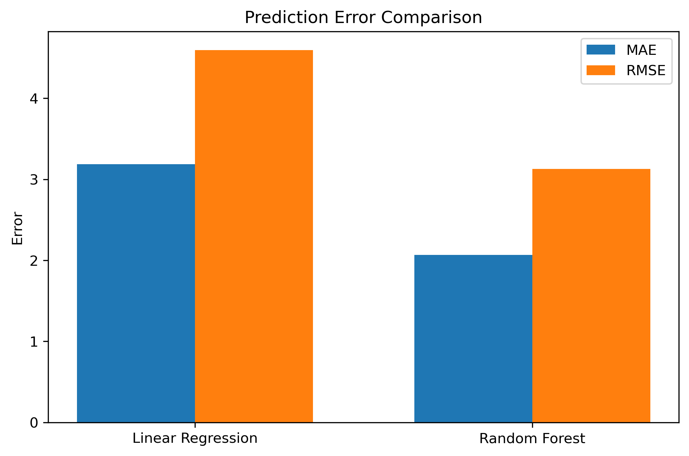

# Boston Housing Price Analysis

## 1. Introduction

This project analyzes Boston housing data to identify factors that may influence housing prices in Boston, and uses linear regression models and random forest methods to forecast housing prices in the city. This study is intended for households considering the purchase of real estate in Boston, as well as government agencies, since policy decisions regarding housing construction, community development, and resource allocation directly impact housing price levels in Boston. Therefore, analyzing the factors influencing housing prices helps to better understand market changes and provides a basis for relevant decision-making.

## 2. Data Summary

This project uses the Boston Housing dataset from Kaggle (<https://www.kaggle.com/datasets/arunjathari/bostonhousepricedata>), which contains median housing prices in Boston and housing characteristics, as defined in the table below.

### Variable Definitions

| Variable | Description |
|--------------------------|----------------------------------------------|
| CRIM | Per capita crime rate by town |
| ZN | Proportion of residential land zoned for lots over 25,000 sq.ft. |
| INDUS | Proportion of non-retail business acres per town |
| CHAS | Charles River dummy variable (1 if tract bounds river, 0 otherwise) |
| NOX | Nitric oxides concentration (parts per 10 million) |
| RM | Average number of rooms per dwelling |
| AGE | Proportion of owner-occupied units built prior to 1940 |
| DIS | Weighted distances to five Boston employment centres |
| RAD | Index of accessibility to radial highways |
| TAX | Property tax rate per 10,000 dollars |
| PTRATIO | Pupil-teacher ratio by town |
| LSTAT | Percentage of lower status population |
| MEDV | Median value of owner-occupied homes (in \$1000s) |

With the exception of the CHAS variable, all other variables are numerical. For this project, we have chosen to use both linear regression and random forest models for analysis. Linear regression is used to explain the linear relationship between the variables and housing prices, while the random forest model is capable of capturing more complex nonlinear relationships, thereby improving predictive accuracy.

### Descriptive statistics

| Variable |   Mean |     SD |    Min | Median |    Max |
|:---------|-------:|-------:|-------:|-------:|-------:|
| CRIM     |   3.61 |   8.60 |   0.01 |   0.26 |  88.98 |
| ZN       |  11.36 |  23.32 |   0.00 |   0.00 | 100.00 |
| INDUS    |  11.14 |   6.86 |   0.46 |   9.69 |  27.74 |
| CHAS     |   0.07 |   0.25 |   0.00 |   0.00 |   1.00 |
| NOX      |   0.55 |   0.12 |   0.38 |   0.54 |   0.87 |
| RM       |   6.28 |   0.70 |   3.56 |   6.21 |   8.78 |
| AGE      |  68.57 |  28.15 |   2.90 |  77.50 | 100.00 |
| DIS      |   3.80 |   2.11 |   1.13 |   3.21 |  12.13 |
| RAD      |   9.55 |   8.71 |   1.00 |   5.00 |  24.00 |
| TAX      | 408.24 | 168.54 | 187.00 | 330.00 | 711.00 |
| PTRATIO  |  18.46 |   2.16 |  12.60 |  19.05 |  22.00 |
| LSTAT    |  12.65 |   7.14 |   1.73 |  11.36 |  37.97 |
| MEDV     |  22.53 |   9.20 |   5.00 |  21.20 |  50.00 |

## 3. Data Analytics

### 3.1 Distribution of House Prices

As shown in the housing price distribution chart, housing prices in Boston are primarily concentrated between 15,000 and 30,000 (thousand dollars). At the same time, the presence of higher-priced homes (nearing 50,000) on the right side of the chart indicates that the data includes a certain number of high-priced properties, which may be located in more desirable residential areas. Furthermore, the overall right-skewed distribution of housing prices suggests that while the number of high-priced homes is relatively small, their prices are significantly higher.

### 3.2 Distribution of Charles River

As shown in the figure, 93.1% of the samples are not located near the Charles River, while only 6.9% are situated near the river. Homes in riverfront areas account for a small proportion of the total and are relatively scarce. Proximity to the Charles River may imply better views and a more pleasant environment; purchasing a home in this area may offer a more enjoyable experience for walking or jogging, which could explain the higher property prices.

### 3.3 Correlation

The variables most strongly correlated with housing prices (MEDV) are the average number of rooms (RM) and the proportion of the population with low socioeconomic status (LSTAT). Specifically, RM shows a strong positive correlation with housing prices, indicating that housing prices tend to be higher as the number of rooms increases; LSTAT shows a strong negative correlation with housing prices, indicating that housing prices tend to be lower as the proportion of the population with low socioeconomic status increases.

### 3.4 Relationship between Variables and House Prices

This chart illustrates the relationship between various explanatory variables and the median home price (MEDV). There is a fairly strong positive correlation between RM and home prices, indicating that the higher the average number of rooms, the higher the home prices tend to be; conversely, there is a clear negative correlation between LSTAT and home prices, suggesting that areas with a higher proportion of residents with low socioeconomic status tend to have lower home prices. Variables such as CRIM, INDUS, NOX, PTRATIO, and TAX generally show a negative correlation with housing prices, suggesting that areas with higher crime rates, a higher proportion of industrial land, higher levels of air pollution, a higher student-to-teacher ratio, and higher property tax rates may have relatively lower housing prices.

## 4. Use linear regression and random forest to predict Boston housing prices

Next, the project will use linear regression and random forest models to perform predictive analysis on Boston housing prices. The linear regression model can capture the linear relationship between various variables and housing prices, while the random forest model is an ensemble method based on decision trees that can capture nonlinear relationships in the data. By comparing the prediction results of the two models, we can more comprehensively evaluate the performance of different methods in housing price forecasting.

### 4.1 Data Preparation

Import the required Python libraries and dataset. Check for missing values in the dataset. Split the dataset into training (70%) and testing (30%) sets.\
That is, the training set contains 354 samples, and the testing set contains 152 samples.

### 4.2 Linear Regression Model

This project uses the training set as the sample, performs an OLS regression with housing prices (MEDV) as the dependent variable and other housing characteristics as independent variables, and uses the resulting model to predict housing prices in the test set. The model-predicted housing prices are then compared with the actual housing prices.

The coefficient for RM is significantly positive, indicating that, after controlling for other variables, higher average household sizes are associated with higher housing prices. The coefficient for LSTAT is significantly negative, suggesting that areas with a higher proportion of residents with low socioeconomic status typically have lower housing prices. In addition, the coefficients for variables such as CRIM, NOX, DIS, and PTRATIO are also significantly negative, indicating that crime rates, air pollution, and greater distance from employment centers may lower housing prices.

We found that the OLS regression suffers from multicollinearity, meaning that there may be some relationships among the explanatory variables. However, since our goal is to predict housing prices rather than to explain the relationships between variables, the impact of multicollinearity on the prediction is limited; therefore, we will not address this issue further here.

This graph illustrates the performance of a linear regression model in predicting house prices, with the x-axis representing actual house prices and the y-axis representing predicted house prices. The red diagonal line indicates that the model’s predictions perfectly match the actual values; the closer the data points cluster around the red line, the better the prediction performance.

### 4.3 Linear Regression Model

This project sets the number of decision trees to 100 and fixes the random seed to ensure that the results are reproducible.

### Feature Importance

Based on the results of the variable importance analysis, RM and LSTAT are the two most critical variables for predicting housing prices. Areas with a lower DIS (distance to employment centers)—that is, those closer to employment centers—tend to have better transportation access and more job opportunities, making them more attractive and thereby driving up housing prices. The importance of CRIM (crime rate) is also quite evident. Areas with higher crime rates typically have poorer living conditions, which may reduce demand for housing and consequently depress housing prices. PTRATIO (student-teacher ratio) reflects the availability of educational resources; a high student-teacher ratio generally indicates relatively scarce educational resources, and educational quality is often a key consideration in families’ home-buying decisions. NOX (air pollution levels) and AGE (proportion of older housing) also have a certain influence, indicating that environmental quality and the age of housing stock similarly affect housing prices. Areas with higher pollution levels or older housing stock are generally less attractive, thereby exerting a negative impact on housing prices.

| Feature | Importance |
|---------|------------|
| RM      | 0.441384   |
| LSTAT   | 0.382217   |
| DIS     | 0.067432   |
| CRIM    | 0.034679   |
| PTRATIO | 0.020828   |
| NOX     | 0.012772   |
| AGE     | 0.012711   |
| TAX     | 0.012326   |
| INDUS   | 0.007716   |
| RAD     | 0.004360   |
| CHAS    | 0.001979   |
| ZN      | 0.001595   |

Compared to OLS regression, the results obtained from the Random Forest regression model are closer to actual housing prices; therefore, we believe that Random Forest provides better predictive performance.

The results of the prediction error comparison chart also support these findings, indicating that the Random Forest model outperforms OLS in predicting housing prices. In other words, the relationship between housing prices and housing characteristic variables is not necessarily strictly linear.

## 5. Conclusion and Policy Recommendation

Based on housing data from Boston, this paper conducts a systematic study of the factors influencing housing prices from the perspectives of data analysis and model prediction. The results indicate that housing prices are influenced not only by the characteristics of the housing units themselves but are also closely related to the socioeconomic conditions of the neighborhood, locational factors, and environmental factors. The average number of rooms (RM) and the proportion of the population with low socioeconomic status (LSTAT) are the two most critical variables. Factors such as distance to employment centers (DIS), crime rates (CRIM), educational resources (PTRATIO), and environmental quality (NOX) also influence housing prices to varying degrees.

Random Forest models are capable of capturing nonlinear relationships and interaction effects among variables, and they significantly outperform linear regression models in terms of predictive accuracy. A comparison of prediction errors further supports this conclusion, indicating that the relationship between housing prices and the various variables is not a simple linear one.

Based on the data analysis for this project, the following policy recommendations are proposed for real estate development: First, in urban planning and housing construction, priority should be given to improving housing quality and the surrounding environment, such as increasing living space and enhancing living conditions. Second, the socioeconomic environment of communities can be improved to boost housing prices by increasing employment opportunities, optimizing the allocation of educational resources, and enhancing public services.
